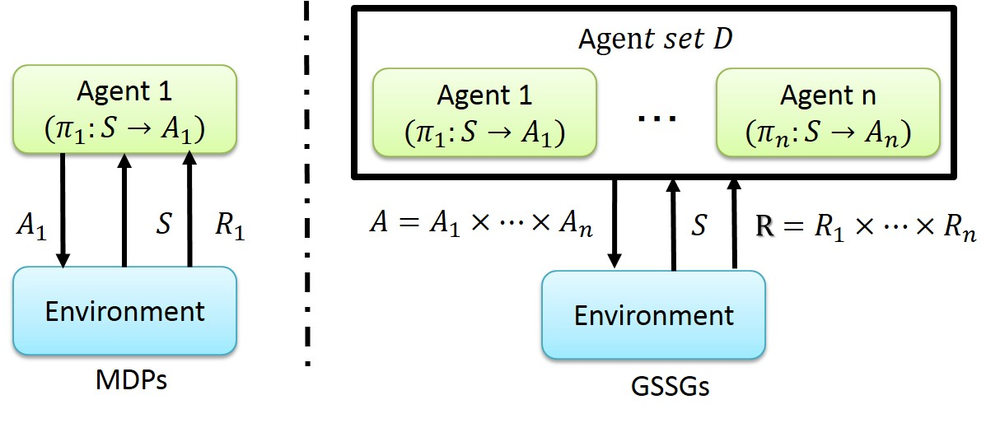

Multi-agent reinforcement learning in stochastic games
====

# What is this package?
This package is unofficial PyBrain extension for __multi-agent reinforcement learning__ in __general sum stochastic games__. 
The package provides 1) the framework for modeling general sum stochastic games and 2) its multi-agent reinforcement learning algorithms. 

## General sum stochastic games (GSSGs)
GSSGs is generalized Markov decision processes (MDPs) for the multi-agent situation, and represented as a tuple _< D, S, __A__ , T, __R__ >_ (right side of following figure). 
_D_ represents agents set, _S_ represents the state of an environment, ___A___ represents joint action of all agents, and ___R___ represents joint reward for each agent. In contrast to MDPs, GSSGs allow multiple agents to affect the environment and receive rewards simultaneously. 
We can model many phenomena in the real world with this model (e.g., trading in market place, negotiation of stakeholders, or collaborative task of robots). 

## Multi-agent reinforcement learning (MARL)
MARL is used for learning agent policies _$$\pi$$_ concurrently. 
_$$\pi_{i}$$_  is a mapping function from a current observed state to a ith agent action (see above figure). 
Each agent policy is learnt to maximize expected cumulative its own rewards, converging to equilibrium (typically Nash equilibrium) where all agent policies cannot be modified to better one. 
This package provides variations of [PHC, PHC-Wolf](http://www.cs.cmu.edu/~mmv/papers/01ijcai-mike.pdf), and [Correlated-Q Learning](https://www.aaai.org/Papers/ICML/2003/ICML03-034.pdf) in addition to GSSGs version of single-agent reinforcement learning implemented in PyBrain. 

# How to use this package?
To use this package, we need 1) install all requirements, 2) implement GSSGs to specify target domain, and 3) apply MARL to implemented GSSGs to learn agent policies. 

## 1. Install Requirement
* Python 2.7.6
* Numpy 1.11.0rc1+
* Scipy 0.17.0+
* PyBrain 0.3.3+

## 2. Implement GSSGs 
Implement the class extending EpisodicTaskSG (pybrainSG.rl.environments.episodicSG) and the class extending Environment class (pybrain.rl.environments.environment). 
Some examples of implementation are put on following directory: 

* pybrainSG.rl.examples.tasks

For example, "gridgames.py" provides am example of grid world domain, and "staticgame.py" provides an example of bi-matrix game domain. 

## 3. Apply MARL to implemented GSSGs
To apply MARL to implemented GSSGs, we need construct an agent set and an experiment. 
You can find examples of construction in following folder: 

* pybrainSG.rl.examples

For example, "example_gridgames.py" in "ceq" directory shows how to use one of Correlated-Q learning implementations in grid game domain. 

# Future work
Implement state-of-art MARL algorithm: 

* Prasad, H. L., Prashanth LA, and Shalabh Bhatnagar. "Two-Timescale Algorithms for Learning Nash Equilibria in General-Sum Stochastic Games." Proceedings of the 2015 International Conference on Autonomous Agents and Multi-agent Systems. International Foundation for Autonomous Agents and Multi-agent Systems, 2015.

# Author
[Takuya Hiraoka](http://isw3.naist.jp/~takuya-h/)
